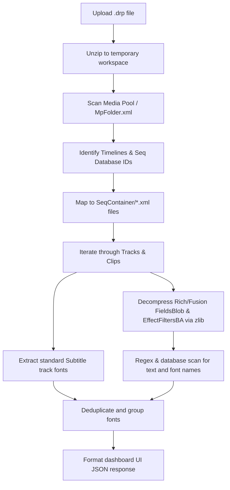

# DaVinci Resolve DRP Font Auditor & Mapper

A desktop utility tool to audit, scan, and map font family usage across timelines directly from a DaVinci Resolve Project (`.drp`) file—completely offline, without needing to open DaVinci Resolve.

) *(Placeholder image path)*

---

## 🚀 Key Features

* **DRP Container Extraction**: Instantly ingests and extracts zipped `.drp` archives safely into temporary memory.
* **Automatic Timeline Mapping**: Scans the Media Pool database structure (`MpFolder.xml`) to map friendly timeline names to their underlying sequence XML files in `SeqContainer/`.
* **Deep Font Auditing**:
  * **Subtitles**: Parses HTML-like styling markup from subtitle generator tracks.
  * **Rich Text / Fusion Titles**: Decompresses binary properties (`FieldsBlob` and `EffectFiltersBA`) using `zlib` (with fallback raw deflate decompression) to scan formatting properties.
* **Dynamic Font Face Detection**: Uses both common font database matching and custom regex patterns (like `Font = "FontName"` or `face="FontName"`) to identify custom and proprietary typefaces dynamically.
* **Specificity Deduplication**: Resolves font name substrings to prevent duplicate cards (e.g., matching `"Helvetica Neue LT Std"` and ignoring the redundant `"Helvetica"` and `"Helvetica Neue"`).
* **Title Content Extraction**: Extracts custom text content (e.g., `"Edited by"`, `"Cinematography"`) to name clips contextually on your dashboard.
* **Sleek Dark Suite Web UI**: Zinc/Slate dark-mode web dashboard featuring drag-and-drop file uploads, real-time logging, a timeline selector, and detailed instance tables (clip name, start timecode at 24fps, and duration).

---

## 🛠️ How It Works (Under the Hood)



Resolve stores metadata for text formatting in compressed hex streams within its XML files. This utility decompresses those streams in memory, runs pattern-matching heuristics, maps them to timeline coordinates, and translates frame values into standard `HH:MM:SS:FF` timecodes.

---

## 📦 Installation & Setup

### Prerequisites
* Python 3.10 or higher
* A modern web browser

### Running Locally

1. **Clone the repository**:
   ```bash
   git clone https://github.com/chrishelms/Davinci-Font-Mapper.git
   cd Davinci-Font-Mapper
   ```

2. **Start the local backend server**:
   ```bash
   python3 app.py
   ```
   *The server runs on `http://127.0.0.1:5001` with debug reloading enabled.*

3. **Open the Dashboard**:
   Go to your web browser and navigate to:
   **[http://127.0.0.1:5001](http://127.0.0.1:5001)**

4. **Upload a DRP File**:
   * Drag your `.drp` project file into the dashed upload area.
   * View the real-time server logs as it parses the database.
   * Pick a timeline from the dropdown to audit font names, element types (Rich vs Subtitle), and clip timings.

---

## 📄 License

This project is licensed under the MIT License.
